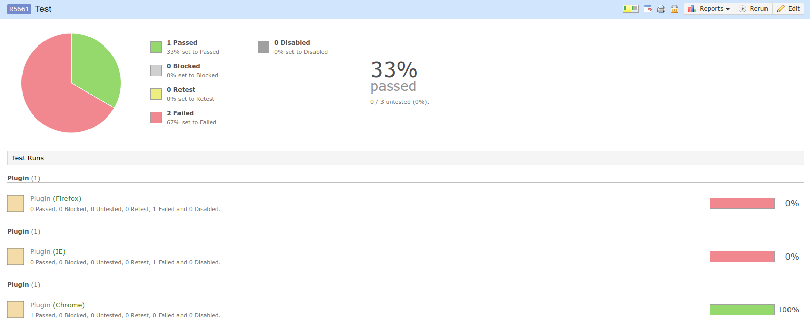

# TestRail API Java Client
--------------------------
# Warning! Achtung! Attention! 
# Project is out of date and not going to be updated until author will use TestRail again. 
# Send your pull-requests if you still want to use this project. 


A Java client library for [TestRail API](http://docs.gurock.com/testrail-api2/start).

## Quick Start
--------------

### Example Usage
```
// create a TestRail instance
TestRail testRail = TestRail.builder("https://some.testrail.net/", "username", "password").applicationName("playground").build();

// create a new project
Project project = testRail.projects().add(new Project().setName("Playground Project")).execute();

// add a new test suite
Suite suite = testRail.suites().add(project.getId(), new Suite().setName("Functional Tests")).execute();

// add a new section
Section section = testRail.sections().add(project.getId(), new Section().setSuiteId(suite.getId()).setName("Boundary Cases")).execute();

// add a test case
List<CaseField> customCaseFields = testRail.caseFields().list().execute();
Case testCase = testRail.cases().add(section.getId(), new Case().setTitle("Be able to play in playground"), customCaseFields).execute();

// add a new test run
Run run = testRail.runs().add(project.getId(), new Run().setSuiteId(suite.getId()).setName("Weekly Regression")).execute();

// add test result
List<ResultField> customResultFields = testRail.resultFields().list().execute();
testRail.results().addForCase(run.getId(), testCase.getId(), new Result().setStatusId(1), customResultFields).execute();

// close the run
testRail.runs().close(run.getId()).execute();

// complete the project - supports partial updates
testRail.projects().update(project.setCompleted(true)).execute();
```


### Custom Case And Result Fields
TestRail supports adding custom case and result fields. The request interfaces in ```TestRail.Cases``` and ```TestRail.Results``` requires a list of these fields in order to allow this library to map them to the correct Java types. Here's an example where we want to to know the separated test steps of a particular test case:
```
// fetch list of custom case field configured in TestRail
List<CaseField> customCaseFields = testRail.caseFields().list().execute();

// get test case
Case testCase = testRail.cases().get(1, customCaseFields).execute();

// assuming separated_steps is a custom TestRail Steps type case field
List<Field.Step> customSteps = testCase.getCustomField("separated_steps");

// work with typed customSteps
......
```
### Full scenario of reporting test results to Test Plan: 
```
            final String url = "http://testrail.example.com";
            final String userId = "nomail@example.com";
            final String pwd = "rootpassword :trollface:";
            final Integer testSuiteId = 1234; // Suite ID should be unique per project
            final Integer planId = 4321; // Test plan reflects current version which is tested
            
            final String browserName = "firefox/chrome/ie";

            TestRail testRail = TestRail.builder(url, userId, pwd).build();

            final String description = "I am description! Change me!";

            final String name = "I_AM_PROJECT_NAME_REPLACE_ME_OR_USE_NAME2";
           
            // First, we need to create list of browser configuration ID's. They are taken from TestRail, DO NOT CHANGE THEM!
            List<Integer> configIds = new ArrayList<>();
            List<Plan.Entry.Run> runList = new ArrayList<>();
            List<Integer> emptyCasesArray = new ArrayList<>();

            switch (browserName.toLowerCase()) {
                case "chrome":
                    configIds.add(258);
                    Plan.Entry.Run chromeRun = (Plan.Entry.Run) new Plan.Entry.Run().setConfigIds(Collections.singletonList(258)).setCaseIds(emptyCasesArray);
                    runList.add(chromeRun);
                    break;
                case "firefox":
                    configIds.add(259);
                    Plan.Entry.Run firefoxRun = (Plan.Entry.Run) new Plan.Entry.Run().setConfigIds(Collections.singletonList(259)).setCaseIds(emptyCasesArray);
                    runList.add(firefoxRun);
                    break;
                case "ie":
                case "internet explorer":
                    configIds.add(257);
                    Plan.Entry.Run ieRun = (Plan.Entry.Run) new Plan.Entry.Run().setConfigIds(Collections.singletonList(257)).setCaseIds(emptyCasesArray);
                    runList.add(ieRun);
                    break;
                case "api":
                    configIds.add(273);
                    Plan.Entry.Run apiRun = (Plan.Entry.Run) new Plan.Entry.Run().setConfigIds(Collections.singletonList(273)).setCaseIds(emptyCasesArray);
                    runList.add(apiRun);
                    break;
                case "unknown":
                    configIds.add(274);
                    Plan.Entry.Run unknownRun = (Plan.Entry.Run) new Plan.Entry.Run().setConfigIds(Collections.singletonList(274)).setCaseIds(emptyCasesArray);
                    runList.add(unknownRun);
                    break;
            }

            List<ResultField> customResultFields = testRail.resultFields().list().execute();
            List<CaseField> caseFields = testRail.caseFields().list().execute();

            for (Result result : results) { // List<Result> results = new CopyOnWriteArrayList<>(); Results are taken from some extension and placed on top of class
                try {
                    testRail.cases().get(result.getCaseId(), caseFields).execute();
                } catch (Exception e) {
                    results.remove(result);
                    System.out.println("\n Test Case with ID " + result.getCaseId() + " does not exist in TestRail! \n");
                }
            }

            Plan.Entry planEntry;
            List<Plan.Entry> entries = testRail.plans().get(planId).execute().getEntries();
            List<Plan.Entry> existingEntries = entries.stream().filter(p -> p.getName().equals(name)).collect(Collectors.toList());

            if (existingEntries
                    .stream()
                    .filter(entry -> entry.getRuns().get(0).getConfigIds().get(0).equals(configIds.get(0)))
                    .map(Plan.Entry::getName)
                    .anyMatch(name::equals)) {
                Plan.Entry existingEntry = testRail.plans().get(planId).execute().getEntries()
                        .stream()
                        .filter(entry -> entry.getName().equals(name))
                        .findFirst()
                        .orElse(null);
                Objects.requireNonNull(existingEntry).setRuns(runList).setCaseIds(results
                        .stream()
                        .map(Result::getCaseId)
                        .collect(Collectors.toList()));

                planEntry = testRail.plans().updateEntry(planId, existingEntry).execute();
            } else {
                Plan.Entry newPlanEntry = new Plan.Entry();
                newPlanEntry
                        .setName(name)
                        .setRuns(runList)
                        .setConfigIds(configIds)
                        .setSuiteId(testSuiteId)
                        .setIncludeAll(true);
                planEntry = testRail.plans().addEntry(planId, newPlanEntry).execute();
            }

            // Here we modify entry and update it
            Plan.Entry finalPlanEntry = planEntry;
            finalPlanEntry
                    .setIncludeAll(false)
                    .setConfigIds(configIds)
                    .setRuns(runList)
                    .setDescription(description)
                    .setCaseIds(results
                            .stream()
                            .map(Result::getCaseId)
                            .collect(Collectors.toList()));

            Plan.Entry.Run run = Objects.requireNonNull(testRail.plans().get(planId).execute().getEntries()
                    .stream()
                    .filter(entry -> entry.getName().equals(finalPlanEntry.getName()))
                    .filter(br -> br.getRuns().get(0).getConfigIds().get(0).equals(configIds.get(0)))
                    .findFirst()
                    .orElse(null))
                    .getRuns()
                    .stream()
                    .filter(run1 -> StringUtils.containsIgnoreCase(run1.getConfig(), browserName))
                    .findFirst()
                    .orElse(null);

            testRail.results().addForCases(Objects.requireNonNull(run).getId(), results, customResultFields).execute();
            testRail.plans().updateEntry(planId, finalPlanEntry).execute();
```
As a result you will get something similar to: 



License
----------
This project is licensed under [MIT license](http://opensource.org/licenses/MIT).
